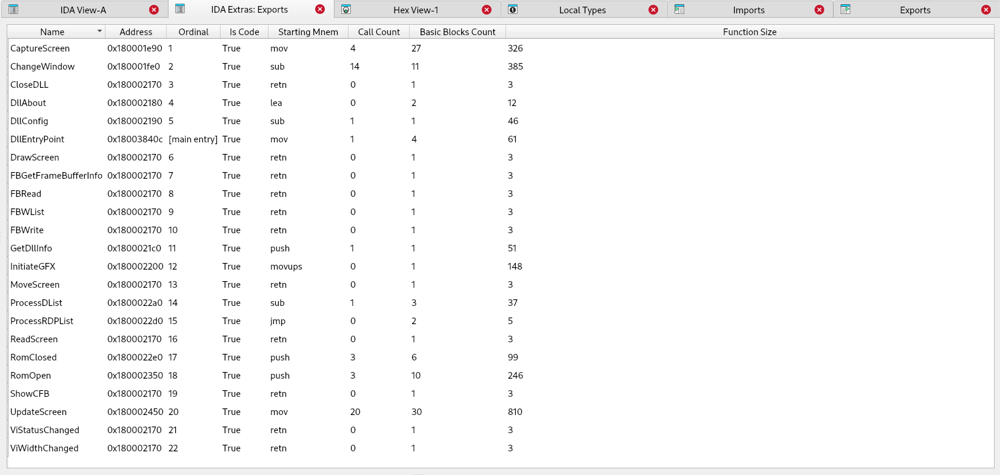

## What is IDA Extras?

IDA extras is a (growing) collection of IDA UI and other enhancements to overcome some challenges when using IDA.  If it possible to do these things natively in IDA, please let me know.

## What Are These Enhancements?

1. Exports
`IDA Extras: Exports` renders another tab similar to the default Exports tab but will provide additional detail about the exports.  This interface came about due to wanting a quick way to find exports of interest when dealing with many exports where a number of them are just retn statements.  There is even an `AutoFilter` option to remove all of the ones with `retn` mnemonic or where the `Is Code` flag is `False`.

**Video**

2. Copy Bytes
`Copy Bytes` works in both the dissembler view and the hex view.  This enchancement copies the bytes selected on the screen.  It's not perfect, but it gets the job done.

Caveat 1: When copying selected bytes in the dissassembler view it makes use of `idc.read_selection_end()` and `idc.read_selection_start()` which, when in the dissassembler view, means all of the bytes on each line are captured.  So if the highlight starts in the middle of one line and ends in the middle of the next line then all of the instructions for both will be copied.

Caveat 2: When copying the bytes in the hex viewer, sometimes one additional byte gets added to the contents copied.

Caveat 3: When copying bytes in the hex viewer, the start and stop positions are determined by when the mouse was clicked and then let up - it does NOT match the contents that get highlighted!

**Video: Dissassembler View**

**Video: Hex Viewer**

